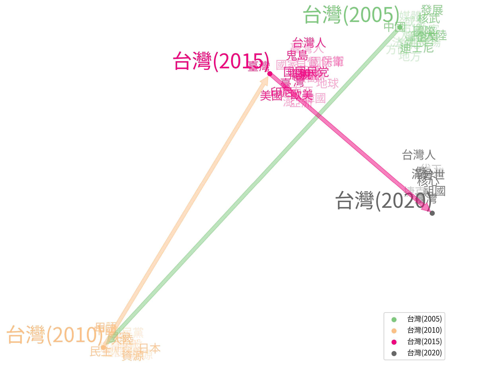

早在\citeyear{sinclair1982reflections}，語言學家\citeauthor{sinclair1982reflections}如此描繪了對於未來語料庫模樣的想像，文字的保存是大量的，其中是緩慢卻不斷變動的語料（"vast, slowly changing stores of text"），亦是對語言演化很詳細的紀錄（"detailed evidence of language evolution"）。

語言，將人們的所思所想傳遞、紀錄下來，並在說話者使用語言時，不斷被重塑與流傳 \parencite[61]{blank1999new}。從共時（synchronic）的角度來看，語意存在各種變異（variation），而在歷時（diachronic）的脈絡下，經過時間累積而則彰顯了各種的變遷。「歷時」所代表的時間範圍可能是近代，也可能是距離我們非常遙遠的歷史時期，近年來文字在網路上大量流傳，加上社會快速變遷，語意表達亦不斷變化。與此同時，歷史文本的電子化數量的增長，使我們得以從中分析、挖掘詞彙所蘊含的詞意。

語料庫作為語言使用的經驗素材，提供了我們從中觀察、歸納出可質化、量化的語言分析，從前述章節提到的keyness及詞向量等概念，我們可以將感興趣的字詞語意帶入時間的軸度，開展了更多與歷時語意相關的研究可能，從語料量化與計算的觀點切入詞彙語意變遷的語言現象。而歷時語料庫更因應科技進步，結合了計算語言學界近年來的語言向量表徵、神經語言統計模型等新方式探求語意在時間洪流下的變動與趨勢。

## 歷時語料庫
- [Corpus of Historical American English (COHA, 1810-2010)](https://www.english-corpora.org/coha/)
- [Corpus of Historical American English (COHA, 1810-2010)]( https://www.english-corpora.org/coha/)
- [A Representative Corpus of Historical English Registers (ARCHER, 1600-1999)](https://www.projects.alc.manchester.ac.uk/archer/)
- [Corpus of Late Modern English Texts (CLMET, 1710-1920)](https://perswww.kuleuven.be/~u0044428/)
- [Sheffield Corpus of Chinese](https://www.dhi.ac.uk/scc/)
- [Academia Sinica Tagged Corpus of Old Chinese (中央研究院上古漢語語料庫, from pre-Qing to pre-Han)](http://lingcorpus.iis.sinica.edu.tw/ancient/), [Academia Sinica Tagged Corpus of Middle Chinese (中央研究院中古漢語語料庫, from late-Han to the Six Dynasties)](http://lingcorpus.iis.sinica.edu.tw/middle/), and [Academia Sinica Tagged Corpus of Early Mandarin Chinese (中央研究院近代漢語語料庫, from Tang to Qing)](http://lingcorpus.iis.sinica.edu.tw/early/). The division into 3 corpora is based on the development of Chinese syntax to offer a synchronic sketch of Chinese and a basis for diachronic comparisons. In the 3 Academia Sinica tagged corpora, raw texts are available, with part of the texts imported from Scripta Sinica (漢籍全文資料庫計畫). It is also worth noting that the Google Books project for Chinese is not available until the year of 1950, and the latest date is 2008. It is believed that corpora creation is the foundation for a more thorough and accurate depiction for data collection during the establishment of lexical databases.

除此之外，Google Ngram Book大量文本加上詳細的年份資訊，也很適合歷時的主題，但因著作權考量，僅開放window size為5的語料使用；歐盟CLARIN（Common Language Resources and Technology Infrastructure）也有許多歷史語料庫的介紹，網址是：https://www.clarin.eu/resource-families/historical-corpora。

在分析歷時語意之前，需要尋找到含有時間資訊的語料文本，以及對語料進行前處理，成為我們可以分析的歷時語料庫。如果是現代的語料，時間資訊細度（granularity）很高，可以針對每十年、每年、甚至每個月等很短的時間間隔，收集到豐富連續的語料，且在語料處理上擁有很多資源能夠讓我們使用。
中古、近代漢語與現代漢語的特色迥異，雖然不如現代漢語語料處理方便，亦已有寶貴的資源可以參考，例如：(1) 語料若是Unicode的形式，除了現代漢語使用的U+4E00至U+9FFF區塊（block），亦有CJK Extension A至F、CJK Compatibility Ideographs以及CJK Compatibility Ideographs可以找到古漢語中常出現的稀有字。(2) 儘管古漢語沒有採行標準化的標點符號系統，我們仍可透過Unicode的CJK Symbols and Punctuations篩選出語料電子化所加上的標點符號。(3) 斷詞是古漢語語料處理的一大困難處，目前有基於特定語料訓練而成的依存句法剖析器（dependency parser），如：[`UD-Kanbun`(Yasuoka, 2019)](https://pypi.org/project/udkanbun/)及`StandfordNLP`的[`Stanza`(Qi et al., 2020)](https://stanfordnlp.github.io/stanza/)。
```r
# 以下是混合了CJK Extension區塊的一些漢字，可以用\\p{Blk=<block>}的方式抓取出符合的結果。
library(stringr)

str_extract_all("䕫滋𬺵哈㐴虁𠓲𫝅𫠧𪜅", "[\\p{Unified_Ideograph}\\p{Blk=CJK}\\p{Blk=CJKExtA}\\p{Blk=CJKExtB}\\p{Blk=CJKExtC}\\p{Blk=CJKExtD}\\p{Blk=CJKExtE}\\p{Blk=CJKExtF}\\p{Blk=CJKCompatIdeographs}\\p{Blk=CJKCompatIdeographsSup}]")

str_extract_all("䕫滋𬺵哈㐴虁𠓲𫝅𫠧𪜅", "[\\p{Blk=CJKExtA}\\p{Blk=CJKExtB}\\p{Blk=CJKExtC}\\p{Blk=CJKExtD}\\p{Blk=CJKExtE}\\p{Blk=CJKExtF}\\p{Blk=CJKCompatIdeographs}\\p{Blk=CJKCompatIdeographsSup}]")
```
## 歷時詞向量
在歷時語料中，有些詞彙並無明顯的詞頻變化，其多義行為亦造成研究者面對巨量資料時的困擾。結合語料統計模型與計算語意學的表徵模型，探究漢語的語意變遷。從數位化的原始語料中，以共現（co-occurrence）分佈的趨勢發覺意義分布的異同，以量化的方式量測語意變遷的程度，並以質化分析輔證已知的例子，並發掘更多可能的例子與規律。

一階向量（first-order embedding）由詞向量模型的原始數值組成，例如：以Word2Vec訓練而成的300維向量。\textcite{hamilton2016cultural}提出以二階向量（second-order embedding）計算語意變遷的程度，將某字詞與其鄰近詞（neighboring word）的相似度串連成數列，來代表這個字詞的語意表徵，更可依據是否取其所有鄰近詞，抑或是部分鄰近詞，細分成全域法（global measure）及部分法（local measure）[^1]，因為以整個語言來看，語意是相對穩定的，而部分法可幫助我們抓取出語意變化較明顯的鄰近詞區段。

[^1]: 從\textcite{hamilton2016cultural}的研究結果中，發現25至50個鄰近詞即可。

以「台灣」一詞為例，從PTT 2005至2020年每五年的語料，看看八卦版及女版的鄰近詞變化，可發現八卦版在2005的鄰近詞有「中國」、「企業」、「國際」、「發展」等，2010年有「民主」、「日本」，到了2015年出現了「鬼島」、「國防」、「國家」，最近的2020年則是「台灣人」、「普世」、「核心」等等。



除了以Word2Vec詞向量探討語意變遷外，亦可以BERT等並語境詞向量（contextualized word embeddings）將多義性（polysemy）的變動做形式表達\parencite{hu2019diachronic,giulianelli2019lexical}。

近年來的歷史詞彙語意研究，從詞意的改變、新舊字詞的興衰，探索其背後的運作機制與認知層面，已開始摸索出語意變遷（semantic change）的規律性（regularities）\parencite[63]{blank1999new}，例如：\textcite{dubossarsky2015bottom}、\textcite{hamilton2016law}、\textcite{xu2015computational}。
1.	\textcite{dubossarsky2015bottom}發現語意變遷的程度與字詞的原型（prototype）為正相關，越非典型的字詞，語意變遷的程度越高，為law of prototypicality。利用K-means分群分析找出字詞的分群，而分群的中心點代表的就是原型，也可以說是沒有成詞（non-lexicalized）的原型，因為這個中心點是分群分析數值計算下的一個點，可以想像該點是抽象的、不存在的一個字詞，而已成詞的原型是最靠近此中心點的另一個點。
2.	\textcite{hamilton2016law}發現，詞彙語意變遷的速度與使用詞頻呈現負相關，而在相同詞頻之下，越多詞意的字詞，語意變遷的程度越高，為law of conformity及law of innovation。從詞彙貢獻網路對應到詞彙的多義程度，再以迴歸分析找出語意變遷程度與詞頻與多義性的關聯。
3.	\textcite{dubossarsky2015bottom}則從近義詞（near-synonym）的角度切入，將law of parallel及law of differentiation兩相比較，發現law of parallel change比較明顯，也就是說近義詞之間的語意變化朝相似的語意發展。語意變遷的程度計算方法找出兩個時間點的共同鄰近詞比例為何，進而推論出近義詞之間隨時間變化的趨勢。

我們以歷時語料庫（中國哲學書電子計畫 \parencite{sturgeon2019ctext}）與現代漢語語料庫（中研院漢語平衡語料庫 \parencite{chen1996sinica}）為語料來源，建立歷時詞向量並搭配詞彙資料庫，並參考 \textcite{hamilton2016cultural} 的全域鄰近詞法，以搭配詞的相似度數值組成二階向量（second-order embedding），提高語意表徵的精確度來比較各時代向量的方法，求其相關係數和語意變遷程度之間的關聯。並從詞彙的意義分布與互動，描繪出不同詞意的消長與變動。

此外，採用以變異程度為基礎的近鄰群聚分析法（Variability-based Neighbor Clustering, VNC）\parencite{gries2012variability}，此階層式的分群可勾勒出綜合性評估各觀察變項的影響下，漢語詞彙發展的時代區分。

計算語意學與歷史語意學的整合研究可以使我們在經驗基礎上回溯驗證個別詞彙的意義變化，更進一步梳理整體的原理原則。詞彙反映人們對於新事物賦予新名的動機、社會概念的更迭也同時牽動詞彙之間的關聯，其應用範圍更可擴及到詞彙與文化變遷的探索。

